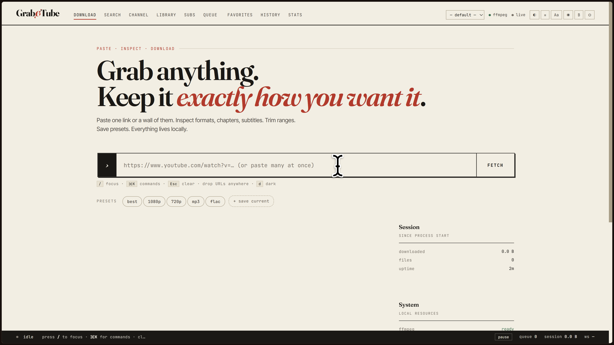
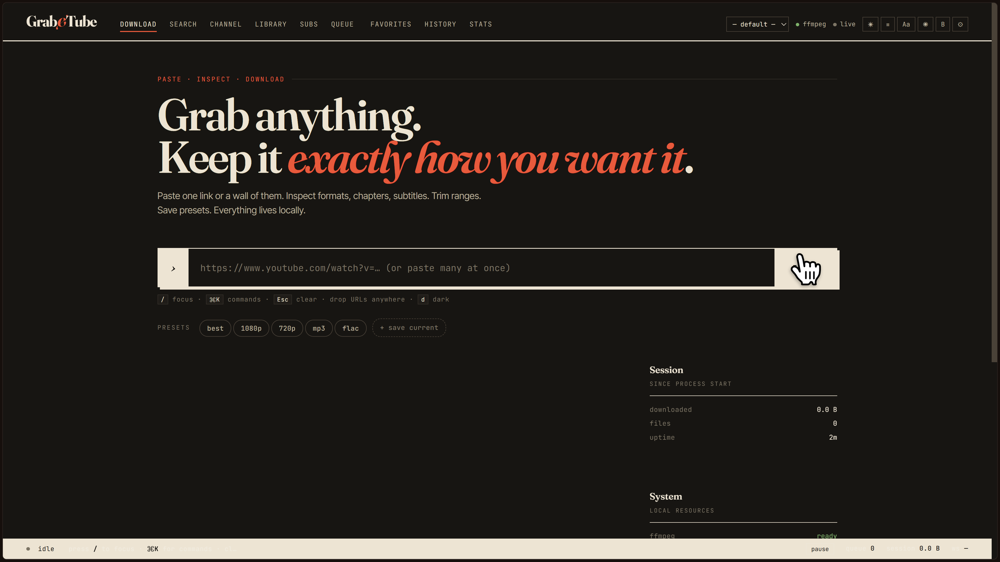
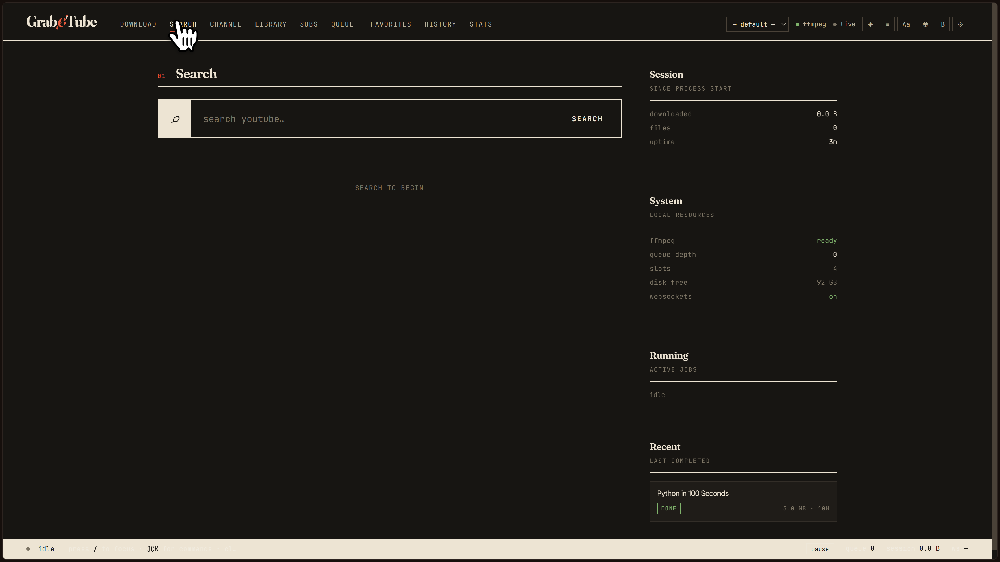
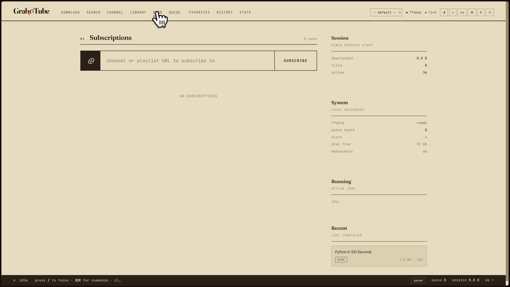
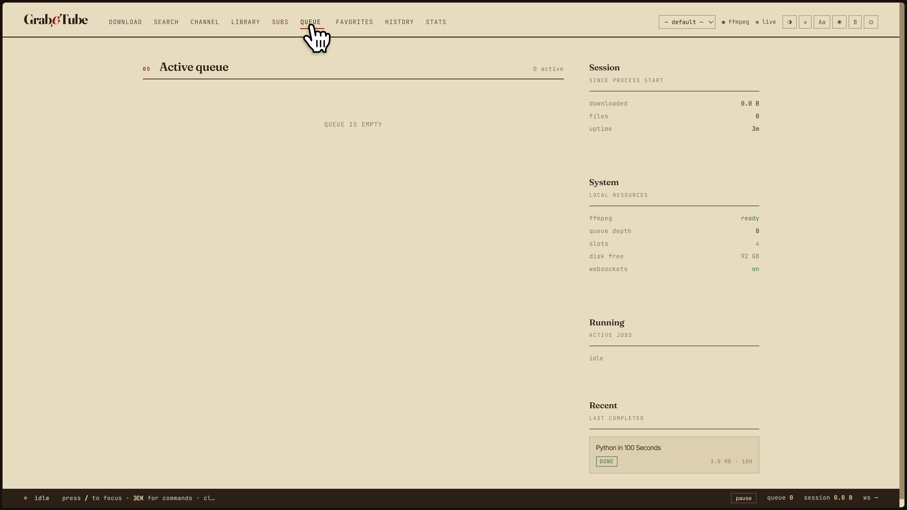
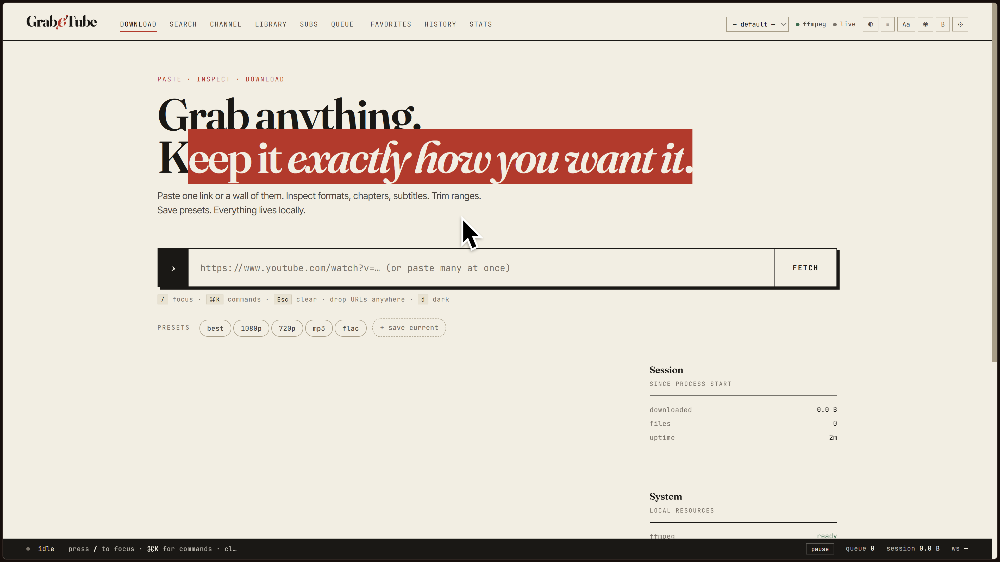
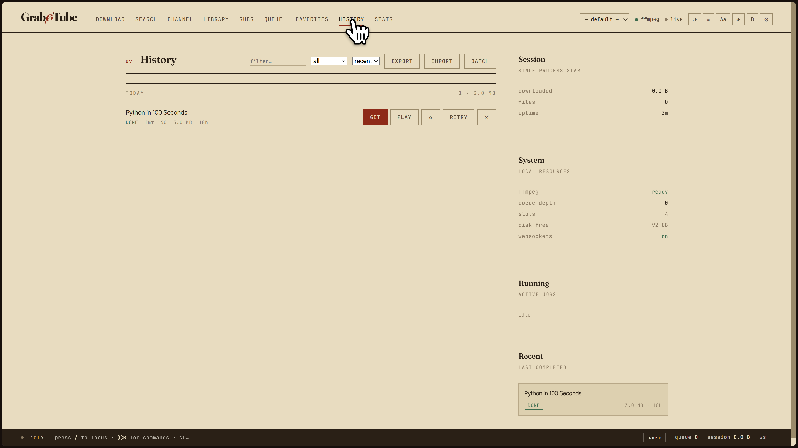
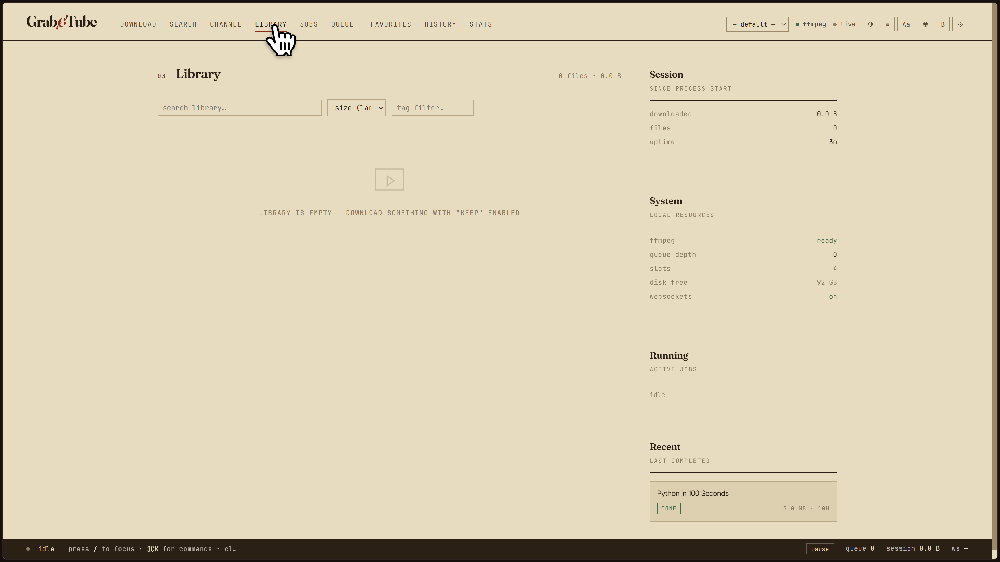
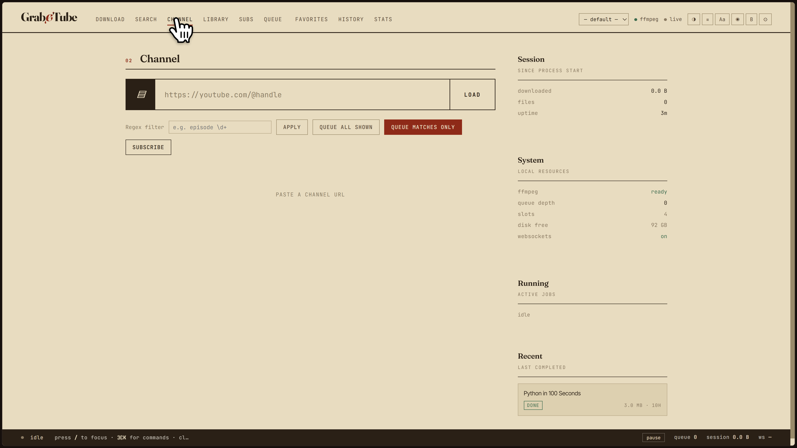

<h1 align="center">Grab&thinsp;Tube</h1>

<p align="center"><em>Self-hosted video downloading with a UI worth using.</em></p>

<p align="center">
  <a href="#install"></a>
  <a href="#install"></a>
  <a href="#docker"></a>
  <a href="LICENSE"></a>
  
</p>

<p align="center">
  
</p>

<p align="center"><em>Pick a format, keep the chapters you want, download. Everything on one screen.</em></p>

---

**GrabTube** is a self-hosted front-end for [`yt-dlp`](https://github.com/yt-dlp/yt-dlp). Paste one URL or forty. Inspect formats, chapters, and subtitles before you commit. Trim ranges. Save presets. Build a library instead of a downloads folder. Everything runs on your machine.

No accounts. No cloud. No telemetry. No upsells.

> **⚠️ For personal use only.** GrabTube is a tool, not a service. You are responsible for what you do with it and for complying with the terms of any site you point it at. It's designed for content you own, content licensed for reuse, and content you have explicit permission to download.

---

## Table of contents

- [What it is](#what-it-is)
- [Features](#features)
- [Screenshots](#screenshots)
- [Install](#install)
  - [Windows](#windows)
  - [macOS / Linux](#macos--linux)
  - [Manual install](#manual-install-i-dont-trust-scripts)
  - [What the scripts actually do](#what-the-scripts-actually-do)
  - [Docker](#docker)
- [Configuration](#configuration)
- [Using it](#using-it)
- [Advanced](#advanced)
- [FAQ](#faq)
- [Troubleshooting](#troubleshooting)
- [Contributing](#contributing)
- [Project layout](#project-layout)
- [Legal](#legal)
- [Credits](#credits)

---

## What it is

`yt-dlp` is excellent, and its interface is a terminal. If that works for you, you don't need this.

GrabTube is what you want when you'd rather see what you're downloading before it happens, and manage a collection rather than a folder. It's for the person who wants to skip the sponsors, keep the Japanese subtitles, grab only the last three chapters of a two-hour stream, and remember what they downloaded six months ago.

It runs locally, listens on `127.0.0.1` by default, and never contacts a server it doesn't need to.

---

## Features

**Get stuff in**
- One URL, a playlist, or forty links pasted at once — it figures out which is which
- Built-in YouTube search
- Browse a channel and queue everything matching a regex
- Subscriptions that check channels and playlists on a schedule
- Drag-and-drop anywhere in the window
- A bookmarklet for one-click queueing from a video page

**Get it right**
- Every format yt-dlp exposes, with real codec names, bitrates, and HDR flags
- Compare two formats side by side before choosing
- Select chapters individually or download a specific range
- Trim by second (`start`/`end`) — works on audio too
- Subtitle picker: language, format, embedded or sidecar
- SponsorBlock category control
- Loudness normalization, metadata embedding, thumbnail embedding
- Custom yt-dlp args passthrough, whitelisted keys only

**Keep it organised**
- Persistent history with search, filters, and sorting
- Pin files so they survive cleanup
- Tags, notes, star ratings, bookmarks
- Watch progress and resume position
- Favorites, separate from the library
- Full-text search across titles and uploaders

**The interface**
- Real-time progress over WebSockets, polling fallback
- Keyboard-first: `/` to focus, `⌘K` for the command palette, arrows to move through formats
- Four themes: paper, dark, sepia, high-contrast
- Three densities: compact, cozy, roomy
- Font scaling, focus mode, an undo stack, and a live console (`Shift+C`) showing raw yt-dlp output
- Proper landmarks, skip link, ARIA live regions, focus visible everywhere, `prefers-reduced-motion` respected

---

## Screenshots

<table>
  <tr>
    <td width="50%">
      
      <p align="center"><sub><b>Every format, decoded</b><br>Real codec names, real bitrates, HDR flags. Sort, filter, compare side-by-side.</sub></p>
    </td>
    <td width="50%">
      
      <p align="center"><sub><b>Chapters and trim</b><br>Uncheck what you don't want, or enter a start and end. Works on audio.</sub></p>
    </td>
  </tr>
  <tr>
    <td width="50%">
      
      <p align="center"><sub><b>Subtitles</b><br>Manual and auto-generated tracks, chosen per download, embedded or sidecar.</sub></p>
    </td>
    <td width="50%">
      
      <p align="center"><sub><b>Live queue</b><br>Real-time progress. Reorder, prioritise, pause the whole queue, cancel individual jobs.</sub></p>
    </td>
  </tr>
  <tr>
    <td width="50%">
      
      <p align="center"><sub><b>A library, not a downloads folder</b><br>Tags, notes, ratings, watch progress. Searchable and filterable.</sub></p>
    </td>
    <td width="50%">
      
      <p align="center"><sub><b>History</b><br>Grouped by day. Retry, pin, delete, with undo. Export to JSON.</sub></p>
    </td>
  </tr>
  <tr>
    <td width="50%">
      
      <p align="center"><sub><b>Search without leaving</b><br>Search YouTube, select a batch, queue it all.</sub></p>
    </td>
    <td width="50%">
      
      <p align="center"><sub><b>Numbers, if you like numbers</b><br>Activity heatmap, 30-day chart, format breakdown, tag counts.</sub></p>
    </td>
  </tr>
</table>

---

## Install

### Windows

1. **[Download the ZIP](https://github.com/YOU/grabtube/archive/refs/heads/main.zip)** and unzip it somewhere permanent — not `Downloads`, not your Desktop
2. Double-click **`run.bat`**

The script checks for Python, sets up a virtual environment, installs dependencies, downloads a portable ffmpeg into `.tools\`, and opens the app in your browser.

First run takes a minute or two. Every run after that launches in about a second — setup is cached.

If SmartScreen complains, click **More info → Run anyway**. The file is a plain-text batch script; you can open it in Notepad and read every line.

### macOS / Linux

```bash
git clone https://github.com/YOU/grabtube.git
cd grabtube
chmod +x install.sh
./install.sh
```

Same behaviour. It checks for Python, sets up a venv, installs dependencies, warns you if ffmpeg is missing (with the correct command for your distro), and opens the app.

### Manual install (I don't trust scripts)

Completely fair. Four steps.

**1. Install Python 3.10+ and ffmpeg**

```bash
# macOS
brew install python@3.12 ffmpeg

# Debian / Ubuntu
sudo apt install python3 python3-venv ffmpeg

# Fedora
sudo dnf install python3 python3-pip ffmpeg

# Arch
sudo pacman -S python ffmpeg

# Windows (PowerShell, user scope, no admin needed)
winget install Python.Python.3.12
winget install Gyan.FFmpeg
```

**2. Create a virtual environment**

```bash
python -m venv .venv        # or: py -m venv .venv on Windows
```

**3. Install dependencies**

```bash
# Windows
.venv\Scripts\pip install -r requirements.txt

# macOS / Linux
.venv/bin/pip install -r requirements.txt
```

**4. Run it**

```bash
# Windows
.venv\Scripts\python app.py

# macOS / Linux
.venv/bin/python app.py
```

Open **http://127.0.0.1:8000**.

### What the scripts actually do

If you'd rather not run something you didn't write, here is the complete behavior of `run.bat` and `install.sh`, in order:

1. Look for Python 3.10+ on `PATH`
2. Create a `.venv/` folder in this directory — not system-wide
3. Run `pip install -r requirements.txt` inside that venv
4. Look for `ffmpeg` on `PATH`
5. On Windows, if ffmpeg is missing: download a portable build from [BtbN's FFmpeg-Builds](https://github.com/BtbN/FFmpeg-Builds) into `.tools/ffmpeg/`. Not installed system-wide; only added to `PATH` for that session
6. On macOS/Linux, if ffmpeg is missing: print the correct install command and **ask before continuing**
7. Launch `python app.py` and open your browser

Nothing touches the registry, `/usr`, `Program Files`, or any system directory. Nothing phones home. Delete `.venv/` and `.tools/` and you're exactly where you started.

### Docker

For servers, NAS boxes, or anyone who already lives in containers.

```yaml
# docker-compose.yml
services:
  grabtube:
    build: .
    container_name: grabtube
    ports:
      - "8000:8000"
    volumes:
      - grabtube-data:/data
      # optional: put finished files somewhere you can see them
      # - /srv/media:/data/library
    environment:
      - GRABTUBE_CONCURRENCY=4
    restart: unless-stopped

volumes:
  grabtube-data:
```

```bash
docker compose up -d
```

Open **http://localhost:8000**.

---

## Configuration

GrabTube reads a `.env` file next to `app.py`, or environment variables, or CLI flags. Precedence: **CLI → env → .env → default**.

Copy `.env.example` to `.env` to get started.

| Variable | Default | What it does |
|---|---|---|
| `GRABTUBE_HOST` | `127.0.0.1` | Bind address. Set `0.0.0.0` for LAN access. |
| `GRABTUBE_PORT` | `8000` | Bind port. |
| `GRABTUBE_DIR` | tempdir | Where the DB, thumbs, and temp files live. |
| `GRABTUBE_CONCURRENCY` | `4` | Max simultaneous downloads. |
| `GRABTUBE_ALLOW_ANY` | `false` | Allow URLs from any host, not just the allowlist. |
| `GRABTUBE_EXTRA_HOSTS` | — | Comma-separated extra hosts to allow. |
| `GRABTUBE_BASE_PATH` | — | Serve under a subpath, e.g. `/grabtube`. |
| `GRABTUBE_JSON_LOGS` | `false` | Structured log output for log collectors. |

Everything else — cookies, rate limits, proxies, filename templates, webhook URL, SponsorBlock categories — lives in **⚙ Settings** and is stored in the local SQLite database.

**CLI flags** (all optional):

```
--host ADDR         bind address (default 127.0.0.1)
--port N            bind port (default 8000)
--allow-any-url     allow URLs from any host
--max-concurrent N  max simultaneous downloads
--base-path PATH    serve under a subpath
```

---

## Using it

**Paste and go.** Drop a URL into the big bar and hit `Fetch`. A video gives you formats, chapters, and subtitles. A playlist gives you a checklist.

**Search inline.** Type `?your query` in the URL bar, or use the Search tab.

**Queue a pile.** Paste forty links separated by newlines. They'll be validated, deduped, and queued as one batch.

**Save your defaults.** Configure what you like, then hit **+ save current** under the presets row. Reapply it next time in one click.

**Subscribe to a channel.** It'll check on a schedule and queue anything new. Each subscription can have its own preset and its own folder layout.

**Trim it.** Uncheck chapters you don't want, or punch in a `start` and `end` in seconds. Works on video and audio.

**Subtitle it.** Click language chips to pick tracks. Toggle **Subs** to fetch them and **Sidecar** to save `.srt`/`.vtt` files alongside the video instead of embedding.

### Keyboard

| Key | Action |
|---|---|
| `/` | Focus the URL bar |
| `⌘K` / `Ctrl+K` | Command palette |
| `?` | Command palette (alternate) |
| `↑` `↓` | Move through formats |
| `Enter` | Download the selected format |
| `c` | Compare the selected format with another |
| `d` | Cycle theme |
| `Shift+C` | Toggle the console |
| `Esc` | Close modal, clear input |

### Themes

Click `◐` to cycle: **paper** (default), **dark**, **sepia**, **high-contrast**. Theme persists between sessions.

### Density

Click `≡` to cycle: **compact**, **cozy** (default), **roomy**. Affects spacing throughout the app.

---

## Advanced

### Reverse proxy

GrabTube works behind nginx, Caddy, Traefik, or anything else. Two things to know:

1. **WebSockets must be allowed** for `/ws`. Without it, the app falls back to polling — functional, but slower.
2. **`GRABTUBE_BASE_PATH` is for subpaths only.** If you're mounting at a subdomain root, leave it blank.

**Caddy** — simplest, handles WebSockets and TLS automatically:

```
grabtube.example.com {
    reverse_proxy localhost:8000
}
```

**nginx:**

```nginx
server {
    listen 443 ssl http2;
    server_name grabtube.example.com;

    location / {
        proxy_pass http://127.0.0.1:8000;
        proxy_http_version 1.1;
        proxy_set_header Upgrade $http_upgrade;
        proxy_set_header Connection "upgrade";
        proxy_set_header Host $host;
        proxy_set_header X-Real-IP $remote_addr;
        proxy_set_header X-Forwarded-For $proxy_add_x_forwarded_for;
        proxy_set_header X-Forwarded-Proto $scheme;
        proxy_read_timeout 3600s;
    }
}
```

The `proxy_read_timeout` line matters — downloads can run long, and nginx's default will kill the connection.

### Accessing from other devices

By default GrabTube only listens on `127.0.0.1`. Nothing on your network can reach it.

To expose it on your LAN:

```bash
# Windows
run.bat --host 0.0.0.0

# macOS / Linux
./install.sh --host 0.0.0.0
```

**There is no authentication.** Anyone on your network can use it, cancel your downloads, and read your library. Only do this on a trusted network. For anything else, put it behind a reverse proxy with auth — Caddy `basicauth`, Authelia, or Cloudflare Access.

### Backups

Everything persistent lives in one place:

- **Script install:** `GRABTUBE_DIR` — set it to a permanent path if you want predictable backups. Default is the system temp directory.
- **Docker:** the `grabtube-data` volume.

The database is `grabtube.db` (SQLite, WAL mode). To back up cleanly, stop GrabTube first, then copy. Or use **Export** in the History view — it produces a JSON file you can re-import later.

### Uninstalling

GrabTube creates exactly two things:

1. The folder you unzipped it into (contains `app.py`, `.venv/`, `.tools/`)
2. `GRABTUBE_DIR` — the database, thumbnails, and temp files

```bash
# Windows
rmdir /s /q .venv .tools

# macOS / Linux
rm -rf .venv .tools
rm -rf "$GRABTUBE_DIR"
```

No registry entries. No system services. No leftover config in `~/.config`.

---

## FAQ

**"ffmpeg not found" / merges fail**

Install ffmpeg and make sure it's on `PATH`. Windows users running `run.bat` shouldn't hit this — the script handles it. Docker users don't either. Test with `ffmpeg -version`.

**"Sign in to confirm you're not a bot"**

YouTube is challenging the request. Open **Settings → Cookies from browser** and pick the browser you're signed into YouTube with. This is the most common issue by far, and the fix is almost always cookies.

**Age-restricted video**

Same fix — cookies from a signed-in browser.

**"HTTP Error 429" / rate limited**

You're downloading too fast. Lower `GRABTUBE_CONCURRENCY`, set a rate limit in Settings (`5M` for 5 MB/s), or wait.

**"Video unavailable"**

Removed, private, or region-locked. If region-locked and you're in the wrong region, set a proxy in Settings.

**Private video**

Needs cookies from a signed-in browser that has access to it.

**A download stops working after a while**

YouTube changed something. Update yt-dlp:

```bash
# if you ran install.sh
.venv/bin/pip install -U yt-dlp

# if you ran run.bat
.venv\Scripts\pip install -U yt-dlp

# if you're on Docker
docker compose pull && docker compose up -d
```

Or enable **auto-update yt-dlp** in Settings.

**Where do files go?**

- **Windows via `run.bat`:** the temp directory, unless you set an **Organize by** rule or a full path in the filename template
- **macOS / Linux via `install.sh`:** same
- **Docker:** inside the `grabtube-data` volume, or wherever you mounted `/data`

Set **Settings → Organize by** to `uploader` or `date` if you want them under `library/` instead of temp.

**Downloads disappear**

Unpinned files are purged from the database after an hour. Pin the ones you want to keep — the ☆ button in History.

**Windows Defender / SmartScreen is yelling at me**

You're running a script Windows didn't sign. Click **More info → Run anyway**. If you'd rather not, use the [manual install](#manual-install-i-dont-trust-scripts).

**Port 8000 is already in use**

Something else has it. Pick another:

```bash
# Windows
run.bat --port 8080

# macOS / Linux
./install.sh --port 8080
```

**How do I update GrabTube?**

```bash
git pull
```

Then `run.bat` or `./install.sh` as usual. If the update added a dependency, you'll get an import error on launch — run with `--reinstall` to fix it.

**How do I reset everything?**

Delete the database. GrabTube recreates it on next launch:

```bash
rm "$GRABTUBE_DIR/grabtube.db"
```

**Can I run this publicly for other people?**

**No.** GrabTube is designed to be self-hosted for personal or internal use. Running it as a public service makes *you* the infringing party and *you* the one getting the DMCA.

**Does it work with [site X]?**

If yt-dlp supports it, GrabTube supports it — but the host allowlist only contains YouTube by default. Add sites with `GRABTUBE_EXTRA_HOSTS` or set `GRABTUBE_ALLOW_ANY=true`. Non-YouTube sites are far less tested; the UI is tuned for YouTube's metadata shape.

**Does it bypass DRM?**

**No.** GrabTube cannot and will not download DRM-protected content — Netflix, Disney+, Amazon Prime, Spotify, and the rest. yt-dlp doesn't do it, and neither does this. Don't ask.

**Why isn't this a desktop app?**

Because it started as a self-hosted tool and grew from there. A packaged desktop build is on the wishlist but not the roadmap — it's a lot of unglamorous packaging work, and the current form factor serves the target audience well. If someone wants to build it, PRs welcome.

**Firefox cookies aren't working**

If Firefox on Linux is installed via Snap or Flatpak, yt-dlp can't read its cookie database — it's in a sandboxed directory. Install Firefox from your distro's native repo, or use a `cookies.txt` file (set `cookies_file` in Settings).

**The WebSocket indicator says "cold"**

Either the `websockets` package didn't install, or a proxy is blocking the upgrade. The app falls back to polling, so this is cosmetic — but install `websockets` and check your proxy config if you want real-time progress.

---

## Troubleshooting

**App starts but the page is blank**

Open the browser console (F12) and check for errors. Most common cause: a reverse proxy mangling `BASE_PATH` or stripping the `/ws` upgrade. Check the network tab for a failed `GET /`.

**Downloads start but never finish**

Check the console (`Shift+C`) for the actual yt-dlp output. It's almost always a rate limit, a cookie problem, or a network timeout on your side.

**Video downloads but no audio**

ffmpeg is missing or broken. Run `ffmpeg -version`. If it errors, reinstall.

**Subtitles aren't being embedded**

`FFmpegEmbedSubtitle` needs ffmpeg built with subtitle support. Most builds have it. If yours doesn't, use **Sidecar** mode instead — it writes the subtitle next to the video and needs no ffmpeg.

**Trim doesn't work**

Trimming requires ffmpeg and is slow for long videos. If it fails silently, check the console for the ffmpeg command and its output.

**Library is empty but I know I downloaded things**

Library only shows entries with `keep=1`. Unpinned entries are purged from the database after an hour. Check History instead — if it's there but not in Library, pin it with the ☆ button.

---

## Contributing

Issues and PRs welcome. Read [`CONTRIBUTING.md`](CONTRIBUTING.md) first — it's short.

Short version: **one feature per PR, tests if you can, don't reformat the whole file.**

---

## Project layout

```
.
├── app.py                 # the entire application
├── requirements.txt
├── run.bat                # Windows — double-click this
├── install.sh             # macOS / Linux
├── Dockerfile
├── docker-compose.yml
├── .env.example
├── README.md
├── CONTRIBUTING.md
├── LICENSE                # AGPL-3.0
└── docs/
    ├── hero.png
    ├── formats.png
    ├── chapters.png
    ├── subtitles.png
    ├── queue.png
    ├── library.png
    ├── history.png
    ├── search.png
    └── stats.png
```

`app.py` is deliberately one file. About 2,500 lines, reads top to bottom. Splitting it into a package is on the list but isn't a priority — the current shape makes it easy to read, fork, and self-host, which is the point.

---

## Legal

GrabTube is a **tool**, distributed under the AGPL-3.0. It does not host, index, or distribute any media. It does not circumvent DRM. It has no servers, no telemetry, no analytics.

You are solely responsible for how you use it, for the content you point it at, and for complying with the terms of service of any site you access and the copyright laws of your jurisdiction. **Downloading copyrighted content without permission may be illegal where you live.**

The maintainers do not condone or support piracy and will not assist with it.

---

## Credits

Built on [`yt-dlp`](https://github.com/yt-dlp/yt-dlp) (Unlicense), [`FastAPI`](https://fastapi.tiangolo.com/) (MIT), and [`uvicorn`](https://www.uvicorn.org/) (BSD). Typography is [Fraunces](https://fonts.google.com/specimen/Fraunces), [Inter Tight](https://fonts.google.com/specimen/Inter+Tight), and [JetBrains Mono](https://www.jetbrains.com/lp/mono/), all under the SIL Open Font License.

If GrabTube saves you time, go star [`yt-dlp`](https://github.com/yt-dlp/yt-dlp). They did the hard part.